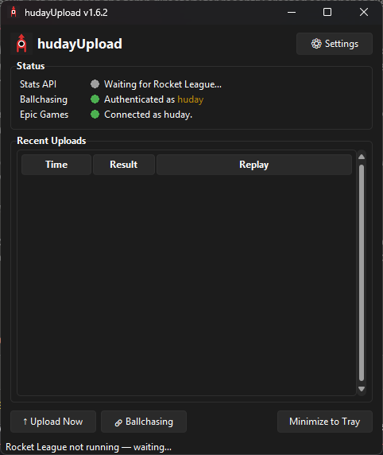

# hudayUpload

Automatically uploads your Rocket League replays to [ballchasing.com](https://ballchasing.com) via the Epic Games / PsyNet API.

## Features

- **Auto-upload** — detects when Rocket League closes and uploads your replays automatically
- **Batch uploads** — fetches your most recent unuploaded matches in each pass (configurable, default 15)
- **Upload after N games** — optionally trigger an upload mid-session after playing a set number of games
- **Epic Games login** — authenticates directly with Epic / PsyNet to download your replay files
- **Ballchasing integration** — uploads to ballchasing.com with your chosen visibility setting; displays your tier username in the correct tier colour
- **System tray** — minimizes to tray so it runs quietly in the background
- **Auto-updates** — checks for new releases on startup and can update itself in one click
- **Dark theme** — Sun Valley dark theme with a matching dark title bar

## Setup

1. Download the latest `hudayUpload.exe` from [Releases](https://github.com/hudayy/hudayUpload/releases)
2. Run it and click **⚙ Settings**
3. **Ballchasing tab** — paste your [ballchasing API token](https://ballchasing.com/upload) and choose a visibility
4. **Epic Games tab** — click **Connect Epic Account** and follow the instructions to log in
5. That's it — launch Rocket League and hudayUpload will handle the rest

## How it works

hudayUpload listens to the Rocket League Stats API (a local TCP socket RL exposes on port 49123) to detect game events. When you close Rocket League (or after you play N games), it refreshes your Epic Games token, fetches your recent match history from PsyNet, downloads the replay files, and uploads any that haven't been uploaded yet to ballchasing.

> **Why not upload after every game?**  
> Connecting to the Epic API creates a duplicate EOS session which can disconnect you from the Rocket League servers mid-game. Uploading only when RL is closed (or after a configurable number of games) avoids this entirely.

## Settings

| Setting | Default | Description |
|---|---|---|
| Upload delay | 45 s | Wait this long after RL closes before fetching replays (gives PsyNet time to process the match) |
| Batch size | 15 | Max replays to upload per pass |
| Upload after N games | 15 | Also trigger mid-session after this many games |
| Visibility | `unlisted` | ballchasing visibility for uploaded replays |
| Start minimized | off | Launch straight to the system tray |
